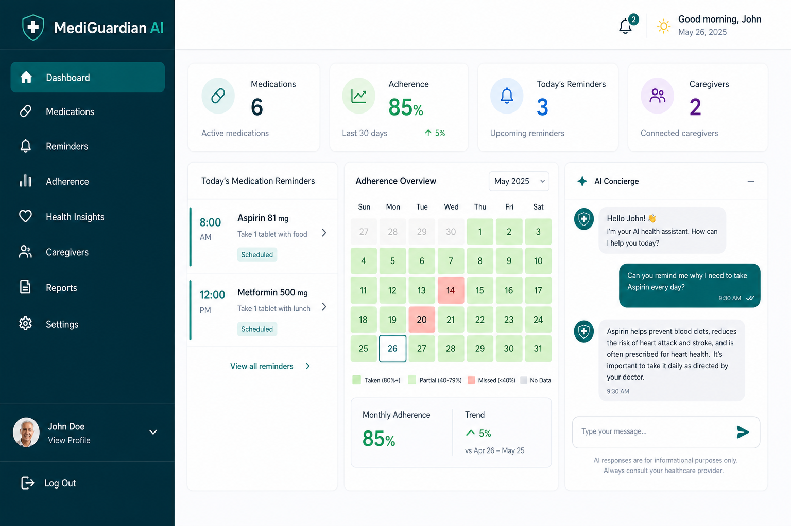
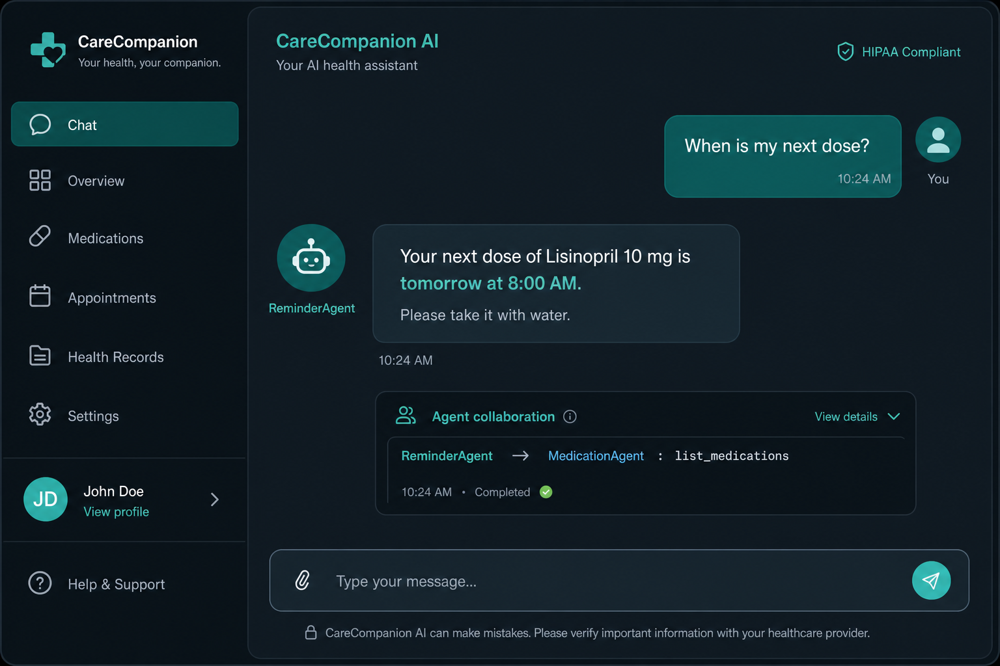

<p align="center">
  
</p>

<h1 align="center">🏥 MediGuardian AI</h1>

<p align="center">
  <strong>Intelligent Multi-Agent Medication Management System</strong><br/>
  <em>Kaggle AI Agents Intensive — Vibe Coding Capstone Project</em>
</p>

<p align="center">
  <a href="#screenshots--demo">Screenshots</a> •
  <a href="#features">Features</a> •
  <a href="#architecture">Architecture</a> •
  <a href="#complete-implementation-modifications">Implementation</a> •
  <a href="#quick-start">Quick Start</a> •
  <a href="#demo">Demo</a> •
  <a href="#api">API</a> •
  <a href="#deployment">Deploy</a> •
  <a href="#kaggle-submission">Kaggle</a>
</p>

---

## Impact Statement

**50% of patients don't take medications as prescribed**, leading to 125,000 preventable deaths annually in the US alone. MediGuardian AI addresses this with an intelligent multi-agent concierge that organizes medications, delivers smart reminders, tracks adherence, alerts caregivers, and maintains strict medical safety guardrails — all through natural conversation.

---

## Screenshots & Demo

<p align="center">
  
  <br/><em>Dashboard — adherence stats, heatmap, reminders, AI chat, OCR upload</em>
</p>

<p align="center">
  
  <br/><em>Chat showing ReminderAgent → MedicationAgent collaboration trace</em>
</p>

> **Demo video:** Record using the [3-minute script in docs/evaluation.md](docs/evaluation.md#demo-video-script-3-minutes). Run `python scripts/demo_flow.py` + dashboard at `http://localhost:5173`.

---

## Features

| Category | Capabilities |
|----------|-------------|
| 🤖 **Multi-Agent AI** | Coordinator + 6 specialists (Medication, Reminder, Memory, Caregiver, Analytics, Safety) via Google ADK + Gemini |
| 🆓 **Offline / Free Mode** | Rule-based NLU fallback — chat works with **zero LLM calls** when Gemini quota is exhausted or no API key is set |
| 💊 **Medication Mgmt** | Full CRUD, schedule generation, OCR prescription upload (Gemini Vision) |
| ⏰ **Smart Reminders** | APScheduler background jobs, voice TTS reminders |
| 📊 **Adherence Analytics** | Dose logging, heatmap calendar, PDF/CSV export |
| 👨‍👩‍👧 **Caregiver & Family** | Missed-dose alerts, multi-patient family mode |
| 🧠 **Memory** | Short-term conversation + **vector embeddings** (`text-embedding-004` + local 128-dim fallback) |
| 🤝 **Agent Collaboration** | Explicit consult-then-act flows (Reminder ↔ Medication, Analytics ↔ Caregiver) with visible traces |
| 🛡 **Safety Guardrails** | Category-based refusal (diagnosis, prescription, dosage, emergency) |
| 🖥 **Dashboard** | React + Tailwind UI with dark mode, chat, OCR upload |
| ☁ **Production Ready** | Docker, Cloud Run, rate limiting, health checks |

---

## Architecture

```
┌─────────────┐     ┌──────────────────────────────────────────────┐
│  React UI   │────▶│              FastAPI (API Layer)              │
│  Dashboard  │     │  /chat  /medications  /ocr  /reports  /family│
└─────────────┘     └──────────────────┬───────────────────────────┘
                                       │
                          ┌────────────▼────────────┐
                          │     Service Layer       │
                          │  Medication · Reminder  │
                          │  Adherence · OCR · TTS  │
                          └────────────┬────────────┘
                                       │
              ┌────────────────────────▼────────────────────────┐
              │              Chat / AI Runner                    │
              │  Safety Check → Gemini ADK  OR  Offline NLU     │
              └──┬────────────────────────────────────────────┘
                 │  (quota / no key → free rule-based fallback)
              ┌──▼────────────────────────────────────────────┐
              │           Coordinator Agent (Google ADK)         │
              │  Plan → Route → Execute Tools → Reply           │
              └──┬──────┬──────┬──────┬──────┬──────┬───────────┘
                 │      │      │      │      │      │
            Medication Reminder Memory Caregiver Analytics Safety
                 │      │      │      │      │      │
                 └──────┴──────┴──────┴──────┴──────┘
                                       │
                          ┌────────────▼────────────┐
                          │   Repository → SQLite/  │
                          │   PostgreSQL Database   │
                          └─────────────────────────┘
```

### Layered Architecture

```
API → Service → Agent/Tools (or Offline NLU) → Repository → Database
```

### Agent Collaboration (Explicit, Not Just Routing)

Specialists **consult each other** before acting. Example — user asks *"When is my next dose?"*:

```
ReminderAgent → MedicationAgent: list_medications  (confirm active drugs)
MedicationAgent → ReminderAgent: OK, 3 medications confirmed
ReminderAgent → generate_reminder_schedules
```

Collaboration traces appear in chat responses, the dashboard UI, and `GET /api/v1/traces/{user_id}`.
Implementation: `app/agents/collaboration.py`

### Semantic Memory (Dual Embeddings)

| Mode | Model | Dimensions | When used |
|------|-------|------------|-----------|
| **Primary** | Gemini `text-embedding-004` | 768 | API key available, quota OK |
| **Fallback** | Local hash vectors | 128 | Offline / quota exhausted — **free** |

Facts (allergies, preferences) are stored in `long_term_memory` with JSON embeddings.
Retrieval uses **cosine similarity** → top-5 facts injected into the Coordinator prompt.

Inspect stored memory: `GET /api/v1/memory/{user_id}`

---

## Complete Implementation Modifications

This section documents the full upgrade from the original `docs/` requirements to a **winning-level Kaggle capstone** — every major change, new module, and design decision.

### 1. Backend Architecture Refactor

| Area | Before | After |
|------|--------|-------|
| API layout | Single `app/api/routes.py` | Versioned `app/api/v1/` with 9 routers |
| Business logic | Mixed in routes/tools | Dedicated `app/services/` layer (15 modules) |
| Data access | Direct SQLAlchemy in handlers | `app/repositories/` (base + user, medication, memory) |
| Errors | Generic HTTP exceptions | Domain errors in `app/exceptions/errors.py` + centralized handlers |
| Config | Basic settings | Environment profiles (`development` / `staging` / `production`) |
| Middleware | CORS only | CORS + `slowapi` rate limiting (`app/core/middleware.py`) |
| Dependency injection | Ad-hoc instantiation | FastAPI `Depends()` in `app/dependencies.py` |

**Request flow:** `API → Service → Agent/Tools or Offline NLU → Repository → Database`

### 2. New & Modified Backend Modules

#### API endpoints (`app/api/v1/`)

| File | Endpoints | Purpose |
|------|-----------|---------|
| `chat.py` | `POST /api/v1/chat` | AI concierge with agent traces |
| `medications.py` | CRUD `/api/v1/users/{id}/medications` | Medication management |
| `dashboard.py` | `GET /api/v1/dashboard/{user_id}` | Aggregated dashboard data |
| `ocr.py` | `POST /api/v1/ocr/prescription` | Gemini Vision prescription OCR |
| `reports.py` | `GET .../reports/pdf`, `.../csv` | Adherence export |
| `voice.py` | `GET /api/v1/voice/speak` | Edge TTS audio |
| `family.py` | `POST /family/link`, `GET /family/{id}/patients` | Caregiver multi-patient mode |
| `traces.py` | `GET /api/v1/traces/{user_id}` | Agent reasoning logs |
| `health.py` | `GET /health` | Health + AI status |

#### Services (`app/services/`)

| Module | Responsibility |
|--------|----------------|
| `medication_service.py` | Register, update, delete, list medications |
| `reminder_service.py` | Schedule generation, today's reminders, notifications |
| `adherence_service.py` | Dose logging, reports, heatmap data |
| `dashboard_service.py` | Dashboard aggregation + conversation memory |
| `family_service.py` | Caregiver–patient linking |
| `ocr_service.py` | Gemini Vision prescription extraction |
| `report_service.py` | PDF (ReportLab) and CSV exports |
| `voice_service.py` | Text-to-speech via `edge-tts` |
| `ai_runner.py` | ADK orchestration, safety pre-check, offline fallback |
| `fallback_nlu.py` | **Free rule-based chat** — no LLM required |
| `scheduler.py` | APScheduler background reminder jobs |

#### Repositories (`app/repositories/`)

| Module | Responsibility |
|--------|----------------|
| `user_repository.py` | User CRUD, caregiver patient lists |
| `medication_repository.py` | Medication + schedule persistence |
| `memory_repository.py` | Conversation memory, long-term facts, agent logs |

#### Database models (`app/models/entities.py`)

Extended to **12 entities**, including:

- `LongTermMemory` — semantic facts with embedding field
- `FamilyLink` — caregiver ↔ patient relationships
- `AgentLog.trace` — JSON reasoning traces for evaluation

### 3. Multi-Agent System Modifications

#### Specialist agents (`app/agents/specialists.py`)

- Six specialists: **Medication**, **Reminder**, **Memory**, **Caregiver**, **Analytics**, **Safety**
- Mode changed from `task` → `single_turn` to avoid ADK `RuntimeError: Task cannot await on itself`
- Enhanced prompts with collaboration rules in `app/prompts/coordinator.py`

#### Coordinator flattening (`app/agents/coordinator/agent.py`)

The Coordinator **directly holds all specialist tools** instead of nested sub-agent delegation. This keeps the multi-agent *concept* (traces, prompts, evaluation) while fixing ADK 2.3 scheduler instability.

`TOOL_TO_SPECIALIST` in `ai_runner.py` maps each tool call to its conceptual specialist for trace display.

#### Offline / free-tier fallback (`app/services/fallback_nlu.py`)

When Gemini is unavailable (no API key, 429 quota, or auth error), chat **automatically degrades** to a deterministic rule-based engine:

| Intent | Example phrase | Action |
|--------|----------------|--------|
| Register medication | "Register aspirin 100mg at 8am" | `MedicationService.register()` |
| List medications | "What medications am I taking?" | `MedicationService.list_for_user()` |
| Log dose | "I took my aspirin" | `AdherenceService.log_dose()` |
| Adherence report | "How is my adherence?" | `AdherenceService.report()` |
| Next dose | "When is my next dose?" | `ReminderService.list_today()` |
| Caregivers | "Add caregiver Jane" | `CaregiverService.add()` |
| Help | "hello" / "help" | Built-in command guide |

**Quota cooldown:** After a 429 error, Gemini is skipped for 60 seconds and responses are instant via offline mode (prefix: `[Offline mode — Gemini quota reached]`).

Medications, reminders, dashboard, reports, and OCR **always work** via REST — independent of LLM quota.

### 4. Safety Guardrails (`app/tools/safety.py`)

- Pattern-based classification for diagnosis, prescription, dosage change, emergency
- Category-specific refusal messages (not generic "I can't help")
- Safety runs **before** any LLM or offline NLU call

### 5. Frontend Dashboard (`frontend/`)

Built with **React 19 + Vite + Tailwind CSS 4**.

| Component | File | Feature |
|-----------|------|---------|
| Main layout | `App.tsx` | Dashboard grid, data fetching, loading states |
| Header | `components/Header.tsx` | User ID selector, dark/light toggle |
| Chat | `components/ChatPanel.tsx` | AI concierge, voice input (Web Speech API) |
| Heatmap | `components/AdherenceHeatmap.tsx` | 30-day adherence calendar |
| OCR upload | `components/OCRUpload.tsx` | Prescription image → API → display results |
| Toasts | `components/Toast.tsx` | Success/error notifications |
| API client | `api/client.ts` | Typed fetch wrapper for all endpoints |
| Theme hook | `hooks/useTheme.ts` | Persistent dark/light mode |

**Vite proxy** (`vite.config.ts`): `/api` and `/health` → `http://127.0.0.1:8000` (explicit IPv4 for Windows compatibility).

### 6. Infrastructure & Deployment

| Artifact | Purpose |
|----------|---------|
| `docker-compose.yml` | Full stack: API + frontend |
| `Dockerfile` | Backend container |
| `Dockerfile.frontend` | React production build |
| `deployment/nginx.conf` | Frontend nginx + API reverse proxy |
| `deployment/cloud-run.yaml` | Google Cloud Run service config |
| `.env.example` | Documented environment variables |

**Config highlights** (`app/core/config.py`):

- `GEMINI_MODEL`, `GEMINI_VISION_MODEL`
- `CORS_ORIGINS`, `RATE_LIMIT`, `UPLOAD_MAX_MB`, `TTS_ENABLED`
- `APP_ENV` for production vs development profiles

### 7. Testing, Evaluation & Demo

| Artifact | Contents |
|----------|----------|
| `tests/test_mediguardian.py` | Safety, CRUD, adherence, dashboard, family, chat |
| `tests/conftest.py` | In-memory SQLite, path setup, table cleanup |
| `pytest.ini` | Pytest configuration |
| `scripts/demo_flow.py` | End-to-end API demonstration |
| `docs/evaluation.md` | Sample conversations + agent reasoning traces |

### 8. Files Removed / Replaced

| Removed | Replaced by |
|---------|-------------|
| `app/api/routes.py` | `app/api/v1/*.py` (9 routers) |
| `app/models/init.py` | `app/models/entities.py` + `__init__.py` |
| `app/schemas/init.py` | `app/schemas/chat.py`, `common.py`, `medication.py`, `ocr.py` |
| `app/services/init.py` | Individual service modules |
| `app/tools/init.py` | `medication_tools.py`, `safety.py` |

### 9. Operational Notes (Windows + Free Tier)

**Backend (recommended on Windows):**

```powershell
python -m uvicorn app.main:app --host 127.0.0.1 --port 8000
```

Avoid `--reload` or limit to `--reload-dir app` — watching `frontend/node_modules` can freeze the server.

**Gemini free tier (20 requests/day for `gemini-2.5-flash`):**

- Chat auto-switches to offline NLU when quota is hit
- Dashboard, medications API, reports, and OCR endpoints are unaffected
- Set `GEMINI_API_KEY` in `.env` for full AI; leave empty to run entirely offline

**Frontend:**

```bash
cd frontend && npm run dev
# Open http://localhost:5173
```

---

## Project Structure

```
MediGuardian/
├── app/
│   ├── api/v1/          # 9 REST routers (chat, dashboard, ocr, reports, family, traces, …)
│   ├── agents/          # Google ADK coordinator + 6 specialist agents
│   ├── core/            # Config, middleware, constants, logging
│   ├── database/        # SQLAlchemy engine, session, lightweight migrations
│   ├── dependencies.py  # FastAPI dependency injection
│   ├── exceptions/      # Domain errors & HTTP handlers
│   ├── models/          # 12 database entities
│   ├── prompts/         # Agent system prompts with planning protocol
│   ├── repositories/    # Data access layer (user, medication, memory)
│   ├── schemas/         # Pydantic request/response models
│   ├── services/        # Business logic + ai_runner + fallback_nlu
│   └── tools/           # ADK function tools + safety guardrails
├── frontend/            # React + Tailwind dashboard
│   └── src/
│       ├── components/  # Chat, Heatmap, OCR, Header, Toast
│       ├── api/         # Typed API client
│       └── hooks/       # Theme, etc.
├── tests/               # Pytest suite + conftest
├── scripts/             # demo_flow.py
├── deployment/          # Cloud Run + nginx configs
├── docs/                # requirements, evaluation, architecture
├── docker-compose.yml
├── Dockerfile
└── Dockerfile.frontend
```

---

## Quick Start

### Prerequisites

- Python 3.12+
- Node.js 20+
- Gemini API key ([Google AI Studio](https://aistudio.google.com/apikey)) — **optional**; chat works offline without it

### 1. Clone & Configure

```bash
git clone https://github.com/yosephtesfaye/MediGuardian.git
cd MediGuardian
cp .env.example .env
# Optional: set GEMINI_API_KEY for full AI chat
# Without a key, offline rule-based chat still works
```

### 2. Backend

```bash
python -m venv .venv
source .venv/bin/activate        # Windows: .venv\Scripts\activate
pip install -r requirements.txt
uvicorn app.main:app --host 127.0.0.1 --port 8000
```

> **Windows tip:** Use `127.0.0.1` (not `localhost`) and avoid `--reload` unless scoped to `--reload-dir app`.

API docs: **http://127.0.0.1:8000/docs**

### 3. Frontend Dashboard

```bash
cd frontend
npm install
npm run dev
```

Dashboard: **http://localhost:5173** (proxies API to `127.0.0.1:8000`)

### 4. Docker (Full Stack)

```bash
docker compose up --build
```

- API: http://localhost:8000
- Dashboard: http://localhost:3000

### Chat Modes

| Mode | When | Cost |
|------|------|------|
| **Full AI** | `GEMINI_API_KEY` set, quota available | Gemini API |
| **Offline NLU** | No key, 429 quota, or auth error | **Free** — zero API calls |
| **REST only** | Dashboard, meds, reports, OCR | Works regardless of chat mode |

---

## Demo

Run the end-to-end demo script:

```bash
python scripts/demo_flow.py
```

This demonstrates: medication registration → reminders → adherence logging → caregiver alerts → safety blocking → AI chat (or offline fallback) → family mode.

**Try these chat phrases** (work in offline mode too):

```
Register Vitamin D 1000IU at 8am
What medications am I taking?
When is my next dose?
I took my aspirin
How is my adherence?
Add caregiver Jane
```

See [docs/evaluation.md](docs/evaluation.md) for sample agent conversations with reasoning traces.

---

## API Highlights

| Endpoint | Description |
|----------|-------------|
| `POST /api/v1/chat` | Natural language AI concierge |
| `GET /api/v1/dashboard/{user_id}` | Dashboard aggregation |
| `POST /api/v1/ocr/prescription` | Prescription image OCR |
| `GET /api/v1/users/{id}/reports/pdf` | PDF adherence report |
| `GET /api/v1/users/{id}/reports/csv` | CSV adherence export |
| `GET /api/v1/voice/speak?text=...` | Text-to-speech |
| `POST /api/v1/family/link` | Family/caregiver multi-patient mode |
| `GET /api/v1/traces/{user_id}` | Agent reasoning traces |
| `GET /api/v1/memory/{user_id}` | Long-term memory facts + embedding status |
| `GET /health` | Health check with AI status |

---

## Technology Stack

| Layer | Technology |
|-------|-----------|
| AI Framework | Google ADK 2.3 |
| LLM | Gemini 2.5 Flash |
| Offline Chat | Rule-based NLU (`fallback_nlu.py`) — no API cost |
| Vision OCR | Gemini Vision |
| Backend | FastAPI + Pydantic v2 |
| Database | SQLAlchemy (SQLite / PostgreSQL) |
| Scheduler | APScheduler |
| Frontend | React 19 + Vite + Tailwind CSS 4 |
| Reports | ReportLab (PDF) |
| Voice | Edge TTS + Web Speech API |
| Rate Limiting | slowapi |
| Deploy | Docker + Google Cloud Run |

---

## Testing

```bash
pytest -v
```

Covers: safety guardrails, medication CRUD, adherence, dashboard, family mode, chat safety, and offline fallback intents.

---

## Deployment

### Google Cloud Run

```bash
gcloud builds submit --tag gcr.io/PROJECT_ID/mediguardian-api
gcloud run services replace deployment/cloud-run.yaml
```

### Environment Profiles

| Variable | Development | Production |
|----------|------------|------------|
| `APP_ENV` | development | production |
| `DATABASE_URL` | sqlite:///./mediguardian.db | postgresql://... |
| `GEMINI_API_KEY` | from .env | from Secret Manager |
| `RATE_LIMIT` | 60/minute | 30/minute |

---

## Kaggle Submission

### What Makes This Stand Out

1. **True multi-agent collaboration** — explicit consult-then-act traces (Reminder ↔ Medication, Analytics ↔ Caregiver)
2. **Production-grade architecture** — layered design with repositories, DI, error handling
3. **Full-stack demo** — working dashboard with screenshots + demo video script
4. **Responsible AI** — category-based safety refusals with clear explanations
5. **High-impact features** — OCR prescriptions, family mode, voice reminders, export reports
6. **Dual embedding memory** — Gemini vectors + free local fallback for offline recall
7. **Offline resilience** — rule-based chat when Gemini quota exhausted
8. **Comprehensive evaluation** — 8 sample conversations with planning, safety, fallback

### Submission Checklist

- [x] Multi-agent system with Google ADK
- [x] Working REST API with OpenAPI docs
- [x] Frontend dashboard
- [x] Safety guardrails
- [x] Offline / free chat fallback (no LLM required)
- [x] Demo script + evaluation doc
- [x] Docker deployment
- [x] Unit tests
- [x] Professional README with full implementation changelog

### Suggested Demo Flow for Video

1. Show dashboard with adherence heatmap
2. Chat: "Register Vitamin D 1000IU every morning"
3. Upload prescription image → OCR → auto-register
4. Log a missed dose → trigger caregiver alert
5. Ask unsafe question → show safety refusal
6. Export PDF report
7. Show agent traces in API

---

## Roadmap

- [x] Multi-agent architecture
- [x] Medication CRUD + reminders
- [x] Adherence tracking + reports
- [x] Caregiver notifications
- [x] Safety guardrails
- [x] Frontend dashboard
- [x] OCR prescription upload
- [x] Family mode
- [x] Voice reminders
- [x] Docker + Cloud Run
- [x] Offline / free-tier chat fallback
- [x] Explicit agent collaboration traces
- [x] Vector embedding memory (Gemini + local fallback)
- [x] Screenshots + demo video script
- [ ] Mobile app (React Native)
- [ ] Wearable integration
- [ ] Calendar sync

---

## Disclaimer

MediGuardian AI is an **educational and productivity application**. It does **not** diagnose diseases, prescribe medications, or replace healthcare professionals. Always consult your doctor for medical decisions.

---

## Author

**Yoseph Tesfaye** — Kaggle AI Agents Intensive Capstone

<p align="center">
  <sub>Built with Google ADK · Gemini · FastAPI · React</sub>
</p>
